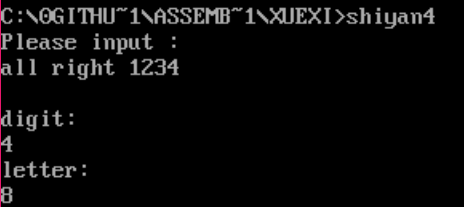

# 汇编实验配套课后习题V1.0
[](https://github.com/Twopothead/Assembly_exp/tree/master/Experiments)
[](https://github.com/Twopothead/Assembly_exp/tree/master/Experiments)

---------------------

## 目录
- 实验二
    - 串操作
      - 1到100求和
- 实验三
    - 转移指令的使用
      - 算术求值：两位数x,y,z,求x-|y|+|z|值
- 实验四
    - 分支程序设计
      - 统计字符串中字母数字个数
- 实验五
    - 循环程序设计
      - 11人成绩求最值并排序
- 实验六
    - 子程序设计
      - 电话号码管理系统

---------------------

###  熊迎军  张俊艺 严一杏 邱日
#### 南京农业大学信息学院  
#### 2017年9月

---------------------------------------

# 正文
------------------------
## 实验二 串操作实验报告

---------------------------

### 1.实验目的
- (1)掌握串操作指令的使用;
- (2)理解算数运算指令、BCD 码调整指令;
- (3)熟练应用 DEBUG 调试汇编程序;

---------------------------

### 2.实验内容
#### 题目:
 使用串操作指令 MOVSB 对一段内存单元中的内容(1,2,3,......,100) 进行转移,再使用串操作指令 CMPS 对转移的内容进行比较来判断传输是否正 确,若不正确则进行重新传输;接着对已经正确传输的 100 个数据进行无符 号型的累加,最后使用 BCD 调整码,最终将答案放入内存,并将其显示在屏幕上。

------------------------------

### 3.实验要求
- (1)上机实验前,仔细复习课本有关知识;
- (2)独立完成实验,画出流程图并上交实验报告;

-------------------------------

### 4.实验步骤
#### 算法分析   
从实验的内容分析可知,要完成如下实验,可分为以下步骤:
- (1)将 1,2,3,......,100 存入数据段相应内存中;
- (2)转移字符串并比较;
- (3)数据累加并调整。

#### 算法设计
##### (1)数据的存入、转移与比较  
已知:
- a. MOVSB 指令的目标操作数与源操作数的逻辑地址由 ES:DI 和 DS:SI 指出;
- b. 串传送指令常与无条件重复前缀连用;
- c. 无条件重复 REP,仅仅判断 CX 是否为 0;
- d. 串比较指令常与条件重复前缀连用,指令的执行不改变操作数, 仅影响标志位。

------------------------------

__注意__:
- (1)在使用串操作指令时需要修改 flag 寄存器当中的 DF 位(方 向位),来确定串
操作的进行方向,具体表现为:CLD 使 DF=0 增地址方 向;STD 使 DF=1 减地址方向;
- (2)数据的累加与调整 BCD 码调整指令 AAM 用来调整寄存器 AX 当中的值,将AL/10 的商放 在 AH 高位中,余数放在 AL 低位当中进行保存。 将结果答案显示到屏幕上时,需要的是数字的 ASCII 码,因此需要 ADD AX,3030H。

-------------------------------

#### 知识回顾:
8086 汇编语言指令系统中提供了 5 种串处理指令。分别是:  
- MOVS (move string) 串传送  
- CMPS (compare string) 串比较
- SCAS (scan string) 串扫描
- LODS (load string) 串获取
- STOS (store string) 串存入

上述串指令应该和重复前缀 REP、REPZ/REPE、REPNZ/REPNE 结合.
- 1.串操作的指令默认目的串的段寄存器为 es 附加段,源串的端寄存器为数据段 ds(当然,
可能出现附加段和数据段为同一段的情况,可以用 assume 进行设定)
- 2.目的串的偏移地址由 di 寄存器给出,源串的偏移地址由 si 寄存器给出。传送次数由 cx 给
出。rep 前缀功能为:重复串操作直到(cx)=(cx)-1=0
- 3.分别给出两种等效的说法
  - rep movs byte ptr es:[di],ds:[si]
= rep movsb
    - 隐式地指出源串和目的串的地址和属性;以字节形式
  - rep mov word ptr es:[di].ds:[si]
= rep movsw
    - 隐式地指出源串和目的串的地址和属性;以字形式

----------------------------------    

关于串比较 cmps dest,source:
- Repz/repe 前缀功能为:结果为 0 或相等就重复操作,若结果不为 0 或不相等提前推出重复操作,此时 cx 还没有减为 0,si 和 di 已经增量。(常用来检测某一字符串与另一字符串是否
完全相同)
- Repnz/repne 前缀功能为:结果不为 0 或不相等就重复操作,若结果为 0 或相等提前推出重复
操作,此时 cx 还没有减为 0,si 和 di 已经增量(用来寻找字或字节,找到即停止)

-----------------

#### 程序说明:
##### 1.两个 showmsg 和 enter 子程序分别用来显示提示字符串和显示回车符。
##### 2.本题实际操作中并没有用到 aam 指令,(由于 aam 指令要求乘积不能超过 99,而本题答案是 5050)
##### 3.过程:
- 5050/10=01f9h(商 505)(ax=01f9h)-----余 0(dx=0) pop dx
- 505/10=0032h(商 50)(ax=0032h)-------余 5(dx=5) pop dx
- 50/10=0005h(商 5)(ax=0005h)-----------余 0(dx=0) pop dx
- 5/10=0(商 0)(ax=0h)------------------------余 5(dx=0) pop dx  

###### 依次将 pop 出来依次得到 5,0,5,0;分别加上 30h 得到相应的 ASCII 码,用 2 号功能显示输出。
##### 4.子程序格式
```Assembly
Zichenxu proc
.............
ret
Zichenxu endp
```
-------------------------

##### 5.本程序中由于被除数 ax 是 16 位寄存器,除数 bp 也是 16 位,故余数放 dx 中,每次除完的商放在 ax 中。  
关于商和余数存放位置的总结:
- div r8/r16
;无符号字节除;al 放商,ah 放余数
- idiv r8/r16
;有符号字节除;al 放商,ah 放余数
- div r16/m16
;无符号字除 ;ax 放商,dx 放余数
- idiv r16/m16
;有符号字除 ;ax 放商,dx 放余数

------------------------------

##### 6.实验截图


------------------------------

##### 7.源代码

```asm
data segment
  msg  db '1+2+3+4+...+100=',0ah,0dh,'$'
  source db 100 dup(0)   ;源串
data ends
extra segment
  dest db 100 dup(0)     ;目的串
extra ends
stack segment
   db 30 dup(0)
stack ends
assume cs:code,ds:data,es:extra,ss:stack
code segment
showmsg proc           ;showmsg子程序调用dos9号中断，显示字符串
    mov ah,9
    mov dx,offset msg  ;AH=9,DS:DX=字符串地址
    int 21h
  ret
showmsg endp
enter proc            ;enter子程序显示回车字符
    mov ah,2          ;2号功能是单字符显示输出
    mov dl,0dh        ;回车ASCII码送dl
    int 21h
  ret
enter endp
start : mov ax,stack
        mov ss,ax
        mov sp,30     ;设栈顶指针
        mov ax,extra
        mov es,ax
        mov ax,data
        mov ds,ax
        call showmsg
        call enter
        mov bx,0            ;bx放源串的偏移地址
        mov al,1
        mov cx,100
    s : mov source[bx],al   ;给源串写入1——100的数据
         inc al
         inc bx
        loop s
  copy: lea si,source
        lea di,dest
        cld                 ;传送方向为正，传送100个字节
        mov cx,100
        rep movsb

        lea si,source
        lea di,dest
        cld                 ;串比较方向为正，比较100次
        mov cx,100
        repz cmpsb          ;结果为0或相等就重复操作
        cmp cx,0            ;若cx不为0，那一定是提前退出的
        jnz copy            ;即两个串并不完全相同，需要重新传送
        mov cx,100
        xor ax,ax           ;ax清零
        xor bx,bx           ;bx清零
        mov di,0
        plus:mov bl,byte ptr es:dest[di]
        add ax,bx
        inc di
        loop plus
        ;此时加完，ax里保存着结果的数值，接下来转十进制
        ;再用ASCII码输出显示

        mov bp,10
        xor bx,bx
        xor cx,cx
  bin2decimal  :mov dx,0
                inc cx  
               ;push多少次，就要pop多少次（again循环）     
               idiv bp     ;有符号字除 r16/m16 (ax)/(bp)
               push dx     ;idiv r16/m16 余数放在dx,商放在ax
               cmp ax,0
        jnz bin2decimal
        mov ah,2
  again:    pop dx
            add dl,30h  ;(dx)的数值加上30h,得到它的ASCII码
            int 21h     ;2号中断显示输出
          loop again    

  mov ax,4c00h
  int 21h
code ends
end start
```

-----------------------------------------
## 实验三 转移指令的使用

-----------------------------

### 1.实验目的
- （1）了解掌握汇编程序中指令跳转的实现；
- （2）掌握算法的设计及表达方式；
- （3）熟练应用 DEBUG 调试汇编程序。

-----------------------------

### 2.实验原理
- 1.）顺序执行的指令地址是由指令指针寄存器 IP 自动增量形成的，而程序
转移的地址必须由转移类指令和 CALL 指令指出，表示转向地址的寻址方式包括：
  - 段内直接寻址
  - 段内间接寻址
  - 段间直接寻址
  - 段间间接寻址
- 2.）与转移地址相关的有三个表示转移距离（称为位移量）的操作符：SHORT、
NEAR、FAR。
  - （1）SHORT，短转移，表示位移量在-128~127 字节之间。
  - （2）NEAR，近转移，表示在同一段内转移，位移量在-32768~32767 字节范围内。
  - （3）FAR，远转移，表示转移距离超过±32K 字节，在不同段之间转移。
- 3.）CS:IP 寄存器总是指向下一条将要执行的指令的首地址（称为 IP 当前值），
当转移指令执行后，必须修改 IP 或 CS、IP 的值。
  - （1）SHORT 转移和 NEAR 转移，位移量分别用 8 位和 16 位表示，程序控制仍然在当前代码段，所以只修改 IP 的值，CS 的值不变。
  - （2）FAR 转移，程序控制超出了当前代码段，所以 CS 和 IP 都必须修改为新的值。
- 4.）与转移地址有关的 4 种寻址方式就是告诉 CPU 如何修改 CS 和 IP 的值，以达到控制程序转移的目的。

------------------------------------

### 3.实验内容
题目：计算 X-|Y|+|Z|，并将计算结果输出显示。

--------------------------------------

### 4.实验要求
- （1）上机实验前，仔细复习课本有关知识；
- （2）独立完成实验，画出流程图并上交实验报告；
- （3）尝试手动输入未知数 X、Y、Z。

------------------------------------

### 5.实验步骤
- 1．）算法分析
从实验的内容分析可知，要完成如下实验，可分为以下步骤：
  - （1）接受键盘输入 X、Y、Z；
  - （2）计算|Y|、|Z|；
  - （3）计算结果并输出显示。
- 2．）算法设计
  - （1）输入未知数  
    - a. 使用 MOV AH,01H INT 21H 实行对字符串的输入，而事实上此功能一次只能输入一个字符，因此使用循环，将每次输入的值，保存在内存当中，当检测到回车字符（ODH）时，即结束当前的循环；
    - b. 负数的输入情况，判断是否有‘-’符号的输入，若有的话，则在最后的数取其补码，一个 AX16 位长，每 4 位表示一个数，因此目前最多只能表示 4 位数以内的加减法运算。
  - （2）计算绝对值
首先使用 TEST AX,8000H，来判断 AX 的最高位符号位是 1 还是 0，若是1 的话则需要 NEG AX,取 AX 的补码，进行运算，TEST 的实质是不保存结果的AND 运算；
  - （3）计算结果并输出
    - a. 最后的计算结果使用 MOV AH,09H INT 21H 进行输出，使用 AAM 等 BCD转换指令将 16 进制转换为 10 进制；
    - b. 判断最后结果的正负问题，若结果为负，则首先显示‘-’字符，再显示最后的结果的补码；
- 3．）完成实验报告

-------------------------

### 6.实验截图  

手动输入两位数：  


---------------------------

### 7.不足与改进
应当扩展到支持更多位，提高程序的容错性。

-------------------------

#### 8.源代码：
```asm
;x-|y|+|z|
;9-6+5=8
;最大支持两位数，97-|67|+|45|=75
;在输入负六时应输入-06
;目前暂不支持结果为负的情况
data segment
  x dw 9
  y dw -6
  z dw 5
  flag db 0
  msg db 'x-|y|+|z|=?,Please input x,y,z:',0ah,0dh,'$'
  xmsg db 0ah,'  x=?  ',0ah,0dh,'$'
  ymsg db 0ah,'y=?  ',0ah,0dh,'$'
  zmsg db 0ah,'z=?  ',0ah,0dh,'$'
  resultmsg db 0ah,'x-|y|+|z|=?',0ah,0dh,'$'
  result dw ?
data ends
stack segment
  dw 16 dup(0)
stack ends
assume cs:code,ds:data,ss:stack
code segment
absolute:
sub ax,0
jns ok
neg ax
ok:
ret
input :
push bx
mov flag,0
chongshu:

mov ah,01h
int 21h
cmp al,'-'
jnz continue
mov flag,1

mov ah,01h
int 21h
continue:

sub ax,0
aaa
mov bl,al
int 21h
aaa

mov ah,0
mov bh,0
mov cx,10
shi:add ax,bx
loop shi
;mov ax,bx
pop bx

cmp flag,0
jz zhen
neg ax
zhen:
mov word ptr[bx],ax

nop
ret
showstring:
mov ah,9
int 21h
mov ax,0
ret

start:

mov ax,data
mov ds,ax

mov dx,offset msg
call showstring
mov dx,offset xmsg
call showstring
lea bx,x
call input
mov ax,0200h
mov dx,word ptr[bx]
add dx,30h
;int 21h ;输出x

mov dx,offset ymsg
call showstring
lea bx,y
call input
mov ax,0200h
mov dx,word ptr[bx]
add dx,30h
;int 21h ;输出y

mov dx,offset zmsg
call showstring
lea bx,z
call input
mov ax,0200h
mov dx,word ptr[bx]
add dx,30h
;int 21h  ;输出z

mov dx,offset resultmsg
call showstring

mov ax,y
call absolute
mov bx,ax
mov ax,z
call absolute
mov bp,ax
mov ax,x
nop
sub ax,bx
add ax,bp
mov dx,ax
nop
mov bp,10
mov ax,dx
mov bx,1
imul bx
aam
add ax,3030h
mov bx,ax
mov dx,0
mov dl,bh
mov ah,2
int 21h
mov dl,bl
int 21h
mov ax,4c00h
int 21h
code ends
end start

```

-------------------------------------

## 实验四 分支程序设计

-----------------------

### 1.实验目的
- (1)掌握汇编语言的分支程序设计的原理与方法;
- (2)掌握并能熟练应用汇编程序的输出显示设计方法;
- (3)掌握汇编程序的数据输入设计方法;
- (4)熟练应用 DEBUG 调试汇编程序;
- (5)掌握算法的设计及表达方式。

-------------------------

### 2.实验内容
- 题目:分类统计字符个数
- 内容:程序接受用户从键盘输入的一行字符(字符个数不超过 80 个字符,该字符串以回车符结束),并按字母、数字及其他字符分类统计个数,然后将相应的结果存放于 letter、digit 和 other 中,并在显示器上显示如下信息:
    - The counted result of the program:
    - letter:××
    - digit:××
    - other:××  
__注：××表示一个十进制数__

----------------------------    

### 3.实验要求
- (1)上机实验前,仔细复习课本有关知识;
- (2)独立完成实验,画出流程图并上交实验报告;
- (3)尝试将结果输出,如不输出,可通过单步执行,将内存单元 letter、digit 和 other 中的内容显示并截图。

-------------------------------

### 4.实验步骤
- 1.)算法分析
从实验的内容分析可知,要完成如下实验,可分为以下步骤:
  - (1)接受键盘的输入,以回车键结束输入;
  - (2)对输入的字符分类统计;
  - (3)输出统计结果。
- 2.)算法设计
  - (1)输入与统计  
  已知:ASCII 码的 0DH 为回车符,DOS 的 1 号功能可接受键盘的输入,存放在(AL)中,可以选用如下算法(伪代码):
```cpp
01h->AH;
NEXTCHAR:
INT 21H;
22if (AL)!= 0DH
if (AL)== letter
letter++;
else if(AL)== digit
digit ++;
else other++;
else JMP NEXTOPERATION
JMP NEXTCHAR;
```
  - (2)输出显示  
  请思考如何将内存中存放的十六进制数转换成 ASCII 码表示的十进
制数并输出。(提示:参考将十进制数转换成二进制数的方法,必要时可借
助堆栈)


-  3.)完成实验报告

-------------------------------

### 5.实验截图



-------------------------------

### 6.源代码

```asm
data segment
letter db 0
digit  db 0
other  db 0
 msg db 'Please input :',0ah,0dh,'$'
 imsg db 'iloveyou',0ah,0dh,'$'
 ;数字 		30h-39h 0011,0000~0011,1001B
 ;大写字母  41h-5ah 0100,0001~0101,1010B
 ;小写字母  61h-7ah 0110,0001~0111,1010B
 ;也可以用test指令简化程序
 buf1 db 100 dup(0)
 dmsg db 0ah,'digit:',0ah,0dh,'$'
 lmsg db 0ah,'letter:',0ah,0dh,'$'
data ends
assume cs:code,ds:data
code segment
showtotal:mov ah,02h
add dx,30h
int 21h
ret
showstring:mov ah,09h
int 21h
ret
start:  mov ax,data
        mov ds,ax
        mov dx,offset msg
        mov ah,09h
        int 21h
     nextchar:      mov ah,01h
 		   int 21h
        cmp al,'A'
        jb xiao
        cmp al,'Z'
        ja  da
        inc letter
    xiao:cmp al,'0'
         jb exit
         cmp al,'9'
         ja exit
         inc digit
    da  :cmp al,'a'
         jb exit
         cmp al,'z'
         ja exit
         inc letter
  exit:
        sub ax,0
  		cmp al,0dh
       jnz nextchar
final:
      mov dx,offset dmsg
      call showstring
      mov dl,digit
      call showtotal
      mov dx,offset lmsg
      call showstring
      mov dl,letter
      call showtotal
  		mov ax,4c00h
        int 21h
code ends
end start
```

---------------------------------

## 实验五 循环程序设计

--------------------------

### 1.实验目的
- (1)掌握汇编语言的循环程序设计的原理与方法;
- (2)掌握并能熟练应用汇编程序的输出显示设计方法;
- (3)掌握汇编程序的循环算法编写;
- (4)熟练应用 DEBUG 调试汇编程序;
- (5)掌握算法的设计及表达方式。

-----------------------------------

### 2.实验内容
- __题目__:  
  - 对随机输入的 11 名学生的成绩进行排序与分数段人数统计,输出最高分,最低分,中间值以及排序后的成绩。
- __内容__:  
  - 定义存储空间存放成绩,输出不及格人数,60~69 分数段人数,......,90~100 分数段人数,对成绩进行排序,输出排序后的结果,在显示器上显示如下信息:
```
The score between 90 and 100 : ××
......
The score between 0 and 59 :××
Min is ××
Max is ××
The middle score is ××
Rank ordering : ×× ×× ××......
````
××表示一个十进制数  

-----------------------------------

### 3.实验要求
- (1)上机实验前,仔细复习课本有关知识;
- (2)独立完成实验,画出流程图并上交实验报告;

--------------------------------------

### 4.实验步骤
-  1.)算法分析
从实验的内容分析可知,要完成如下实验,可分为以下步骤:
  - (1)输入分数并转换;
  - (2)排序,得到中间值,最高分,最低分;
  - (3)统计各个分数段的人数;
  - (4)输出结果。
-  2.)算法设计
  - (1)输入与转换  
      - 定义一个缓冲区[1],存放操作者以数字和空格键入的字符串。
  - (2)排序  
      - 可运用冒泡排序,选择排序等方法对 11 个分数进行排序。
  - (3)统计人数与输出显示
      - 可参考实验四。
-  3.)完成实验报告

注[1]：缓冲区      
```asm
    BUF db 8 0,?,80 dup(0)
```  
__提示__:  
  - 输入分数以空格(20H)隔开,通过判断是否为空格划分分数。对于不是空格的字符需要看它的后一个字符是不是空格,如果是则它是个位数,如果不是则该数字将是一个两位数,然后进行相应的操作;在数据段定义 11 个存储空间以存放进行操作后的 11 个键入的分数。

----------------------------------------------

### 5.实验截图


-------------------------------------------------

### 6.源代码

```asm
data segment
	buf   db  80,?,80 dup('$')
	score db  80 dup('$')
	x     dw  0
 msg 	db 'The score between 90 and 100:',0ah,0dh,'$'
 minmsg db 'Min is :',0ah,0dh,'$'
 maxmsg db 'Max is :',0ah,0dh,'$'
 midmsg db 'The middle score is:',0ah,0dh,'$'
 rankmsg 	db 'Rank ordering:',0ah,0dh,'$'
data ends
stack segment
   db 16 dup(0)
stack ends
assume cs:code,ds:data,ss:stack
code segment
huanhang:
	mov ah,02h
	mov dl,0ah
	int 21h
	ret
showstring:
	mov ah,09h
	int 21h
	ret
transf:
   push cx
	mov x,0
	mov cx,2
	getnum:
		mov al,[si]
		sub ax,0
		cmp al,20h
		jnz feikongge
		inc si
		jmp getnum
feikongge:
		and ax,000fh
		xchg ax,x
		mov dx,10
		mul dx
		add x,ax
		inc si
	loop getnum
	mov ax,x
	mov word ptr score[di],ax
	mov x,0
	add di,2
   pop cx
 ret
xianshi:
	mov cx,20
	mov di,0
	show:
		mov ah,2
		mov bx,word ptr score[di]
		mov dl,bl
		add dl,30h
		int 21h
		add di,2
		loop show
		call huanhang
	ret
huanchong:
		mov ah,9
		lea dx,buf+2
		int 21h
		ret
bin2dec:
		mov ax,bp
		mov bl,1
		imul bl
		aam
		add ax,3030h
		mov bx,ax
		mov ah,2
		mov dl,bh
		int 21h
		mov dl,bl
		int 21h
		ret
zhanshi:
mov cx,11
mov si,0
xx:mov bp,word ptr score[si]
call bin2dec
mov ah,2
mov dl,20h
int 21h
add si,2
loop xx
ret  
start:
;mov ax,stack
;mov ss,ax
;mov sp,20h
mov ax,data
mov ds,ax
mov  dx, offset buf
mov ah,10
int 21h
mov ah,2
mov dl,0dh
int 21h

call huanhang

lea si,buf
add si,2
mov cx,11
mov di,0
shu:call transf
loop shu
exit:

mov bx,0
mov cx,10;循环次数：11-1=10（次）
daxunhuan:mov dx,cx
          mov di,0
     	  xiaos:
      			 mov bp,word ptr score[di]
     			 add di,2
   			     cmp bp,word ptr score[di]
       			 jna zhenchang
     		    xchg bp,word ptr score[di]
     			zhenchang:
    			 mov word ptr score[di-2],bp
   			  loop xiaos
    	 mov cx,dx
    	 loop daxunhuan
    	 nop
    	 nop  

	mov di,0
	mov dx,offset msg
	call showstring
	;call xianshi


	call huanhang
	mov ah,2
	mov dl,0dh
	int 21h
	mov ah,9
	mov dx,offset minmsg
	int 21h

mov bx,word ptr score[0]
mov bp,bx
call bin2dec
call huanhang


mov dx,offset maxmsg
call showstring
mov bx,word ptr score[10*2]
mov bp,bx
call bin2dec
call huanhang

mov dx,offset midmsg
call showstring
mov bx,word ptr score[5*2]
mov bp,bx
call bin2dec
call huanhang

mov dx,offset rankmsg
call showstring
call zhanshi
mov ax,4c00h
int 21h

code ends
end start
```

------------------------------------

## 实验六 子程序设计

-------------------------

### 1.实验目的
- (1) 综 合 掌 握 比 较 复 杂 的 汇 编 程 序 设 计 方 法 ;
- (2)熟练应用 DEBUG 调试汇编程序;
- (3)掌握算法的设计及表达方式。

------------------------------

### 2.实验原理
利用本学期所学知识:汇编语言数据的存储方式,循环程序、分支程序
以及子程序设计的方法,DOS 中断调用等,设计一个比较复杂的综合应用程序。

-------------------------------

### 3.实验内容
- 1.)建立一个可存放 50 项的电话号码表,每项包括人名(20 个字符)及电话号码(8 个字符)两部分;
- 2.)程序可接收输入人名及相应的电话号码,并把它们加入电话号码表中;
- 3.)凡有新的输入后,程序应按人名对电话号码表重新排序;
- 4.)程序可接收需要查找电话号码的人名,并从电话号码表中查出电话号码,再在屏幕上显示出来 。
```
name tel..
××× ×××
```
---------------------------

### 4.实验要求
- 1.)上机实验前,仔细复习课本有关知识;
- 2.)独立完成实验,画出流程图并上交实验报告;
- 3.)主程序的主要部分如下:
    - (1) 显示提示符‘Input name:’;
    - (2) 调用子程序 input_name 接收人名;
    - (3) 调用子程序 stor_name 把人名存入电话号码表 tel_tab 中;
    - (4) 显示提示符‘Input a telephone number:’;
    - (5) 调用子程序 inphone 接收电话号码,并把它存入电话号码表按人名排序;
    - (6) 显示提示符‘Do you want a telephone number?(Y/N)’;
    - (7) 回答 N 则退出程序;
    - (8) 回答 Y 则再显示提示符‘name?’;
    - (9) 调用子程序 input_name 接收人名;
    - (10) 调用子程序 name_search 在电话号码表中查找所要的电话号码;
    - (11) 调用子程序 printline 按要求格式显示人名及电话号码;
    - (12) 重复查号提示符直至用户不再要求查号为止。
-   4.)完成实验报告。

---------------------------------------

### 5.实验截图

- 输入人名和电话号码  

- 选择是继续增加记录还是搜索电话簿  

- 搜索结果  


-------------------------------------------

### 6.源代码

```asm
data segment
  msgname          db 'Input name:$'
  msgphone         db 'Input telephone number:$'
  msgtishi         db 'If you want to add,press 1',0DH,0AH,'If you want to search,press2',0DH,0AH,'$'
  msgyn            db 'Do you want to kill this process?(y/n)',0dh,0ah,'$'
  huanchong        db 16,?, 17 dup(?)
  shows            db 30 dup('0')
  hmtimes          db 0
  cxvalue       dw 3
  temp             db 20 dup('1')
  msg1             db 'name:$'
  msg2             db 'telephone number:$'
  msgkongge        db  5 dup(32),'$'
  pos           dw 0
  total         dw 3
  zhaodaoweizhi dw 0
  ;开始一次性输入3个人，如果有新增的，total会加
data ends
assume ds:data,cs:code,es:extra,ss:stack
stack segment
    db 200 dup (0)
stack ends
extra segment
    namespace db 800 dup('0')
    numspace  db 800 dup('0')
extra ends
code segment

;初始化宏，设置数据段，附加端，栈段
init macro
    mov ax,data
    mov ds,ax
    mov ax,extra
    mov es,ax
    mov ax,stack
    mov ss,ax
    mov sp,200
endm

;结束宏，4c号中断
finish macro
    mov ax,4c00h
    int 21h
endm

;输入字符串宏
inputstr macro str
    mov ah,10       ;10号中断输入字符串
    lea dx,str
    int 21h
    mov al,str+1  ;str[0]为最大允许字符数，str[1]为实际输入数
    add al,2
;str[2]开始是正文，正文结束的后一个字符为str[实际输入个数+2]
    mov ah,0
    mov si,ax
    mov bp,ax
    mov str[si],'$';在字符串结尾添加$符号
endm

;显示字符串(对应inputstr宏)
showstr macro str
    mov ah,9
    lea dx,str+2
    int 21h
endm

;显示字符串提示
showmsg macro msg
    mov ah,9
    lea dx,msg
    int 21h
endm

;2号功能显示0-9字符
showchar macro char
    mov ah,2
    mov dl,char
    add dl,30h    ;0-9数值加30h为其对应ASCII码
    int 21h
endm

;字符串存储宏
store macro dest,cishu
    lea si,huanchong+2
;缓冲区是通过10号功能输入的，从huanchong[2]开始
    lea di,dest
    mov ah,0
    mov al,cishu
    mov cx,16
;缓冲区大小为16
    mul cx
    add di,ax ;通过这种方式实现对二维数组的寻址
    cld
    mov cx,bp
    rep movs byte ptr es:[di],ds:[si]
endm

showch macro ch  ;2号功能显示字符
    mov ah,2
    mov dl,ch
    int 21h
endm

maopao macro space
local outlp
local inlp
local next
local xunhuan
local huan
local jishu
local budeng
local compare
local jieliinlp
local jielioutlp
;定义本地local标号
;不然当不止调用一次时，多个相同的标号被嵌进主程序，引发混乱
  ;mov cx,3
      mov cx,total;total这个字单元存着待排序的总人数
      dec cx;外循环的次数为(总人数-1)
      mov si,0;si中存第几个人
      mov bx,0;bx存对某人的姓名中某个字符的相对偏移地址
      mov dx,cx
outlp:mov dx,cx;外层循环，保存cx到dx
      mov bx,0
      mov si,0
inlp: mov al,byte ptr es:space[si][bx]
      cmp al,byte ptr es:space[si][bx+16]
       ;比较相邻两个人的对应位置的字母
      jb next  ;如果是顺序则下一个
      ja huan  ;如果是逆序则交换
;以下代码一直到huan标号前都是对两个字母相同情况处理
      push cx  ;保存cx,bx
      push bx
jishu:inc bx   ;计数，计算从此字符到$符号还有几个，作为cx值
      mov al,byte ptr es:space[si][bx]
      cmp al,'$'
      jnz jishu
      mov cx,bx ;离字符串介绍还剩几个字符就循环几次
      mov bx,0
compare:    mov al,byte ptr es:space[si][bx]
            cmp al,byte ptr es:space[si][bx+16]
            jnz budeng;比较下一个字符，直到出现不同字符为止
            inc bx
            loop compare
;;;;;;;;;;;;;;;;;;;;;;;;;;;;;;;;;;;;;;;;;完全匹配      
      mov bx,0
      pop bx   ;恢复bx，cx
      pop cx
      jmp next ;如果这两个字符串完全相同就下一个
;;;;;;;;;;;;;;;;;;;;;;;;;;;;;;;;;;;;;;接力站
jieliinlp:jmp inlp
jielioutlp:jmp outlp
;;;;;;;;;;;;;;;;;;;;;;;;;;;;;;;;;;;;;;接力站
   budeng : pop bx ;恢复bx，cx,对应前面的pop
            pop cx
            jb next ;如果是顺序则下一个
            ja huan ;如果是逆序则交换
   huan: exchange namespace ;把相邻人的名字交换
         exchange numspace  ;把相邻人的电话号码交换
      ;;;;;;xchg al,byte ptr es:space[si][bx+16]
      ;;;;;;mov byte ptr es:space[si][bx],al
  next:  add si,16
         dec dx  ;把dx中保存的cx值减1
         cmp dx,0
        jnz jieliinlp ;内层循环
        loop jielioutlp ;外层循环
endm

;交换宏;通过栈暂存数据，交换相邻的人的名字或电话号码
exchange macro space
local xunhuan
     push cx
     push bx
                mov cx,8
       xunhuan: push word ptr es:space[si][bx+16]
                push word ptr es:space[si][bx]
                pop word ptr es:space[si][bx+16]
                pop word ptr es:space[si][bx]
                add bx,2
       loop xunhuan
      pop bx
      pop cx
endm

;显示宏
show macro dest
local ok    ;宏汇编中防止多次存入同一个地址, 用local
local jieshu;宏汇编中防止多次存入同一个地址，用local
   mov ah,2 ;2号功能只能显示一个字符
   lea di,dest ;通过判断是否到了$符号来达到显示字符串的目的
ok:mov dl,es:[di]
   cmp dl,'$'
   jz jieshu
   int 21h
   inc di
   jmp ok
jieshu: nop
endm

enter macro ;回车宏
    mov ah,2
    mov dl,0ah
    int 21h
endm

display macro ;此宏主要供调试时显示内存的内容
local aga
local agai
    mov di,0
    mov cx,100
    mov ah,2
    mov bx,0
aga:mov dl,byte ptr es:namespace[di][bx]
    inc di
    int 21h
    loop aga
    mov cx,100
    mov di,0
agai:mov dl,byte ptr es:numspace[di][bx]
    inc di
    int 21h
    loop agai
endm

;展示存储后的姓名宏
;用在输入姓名之后
restoreshowname macro  
local again
    push di
    push cx
    mov cx,8
    mov di,0
again:
    push word ptr es:namespace[di][bx]
    pop word ptr ds:temp[di]
;把附加段的姓名区的内容缓存到数据段的temp区
    add di,2
    loop again
    mov ah,9
    mov dl,offset temp
;把temp区字符串的内容用9号功能显示输出
    int 21h
    pop cx
    pop di
endm

;展示存储后的电话号码宏
;用在存好电话号码之后
restoreshownum macro
local again
push di
push cx
    mov cx,8
    mov di,0
  again:
    push word ptr es:numspace[di][bx]
    pop word ptr ds:temp[di]
    add di,2
  loop again
    mov ah,9
    mov dl,offset temp
    int 21h
pop cx
pop di
endm

;此宏主要用在调试阶段
;调试完成后此宏没什么用
displ macro
local aga
local agai
    mov di,0
    mov cx,3
    mov ah,2
    mov bx,0
aga:mov dl,byte ptr es:namespace[di][bx]
    add di,16
    int 21h
    loop aga
    mov cx,3
    mov di,0
agai:mov dl,byte ptr es:numspace[di][bx]
    add di,16
    int 21h
    loop agai
endm


showlist macro
local again
      enter
      enter
      mov bx,0
      mov cx,total          ;有多少人就显示多少次
      ;mov cx,3
    again:
      showmsg msg1          ;输入姓名提示
      restoreshowname  pos  ;把姓名存到对应位置
      showmsg msgkongge     ;显示空格
      showmsg msg2          ;输入号码提示
      restoreshownum        ;把号码存到对应位置
      enter
      add bx,16
      mov pos,bx            ;弄好下一个位置
    loop again
endm

search macro   ;搜索宏
local aga
local again
local ok
local s
local xunhuan
local success
local zhaodao
    inputstr huanchong
    showstr huanchong
enter
enter
    xor dx,dx
    mov dl,huanchong[1]
    mov bp,dx
    mov di,0

    ;mov cx,3;;;;;;;;;;;;;;;;;;;;;;;;;;;;;;;;;;;;;;;;;;;;;;;;;
    mov cx,total
again:mov dl,byte ptr es:namespace[di]
    mov ah,2
    int 21h
    cmp dl,byte ptr huanchong[2]
    jz ok
    add di,16
loop again

ok:mov zhaodaoweizhi,di
    push di;;;;;;;这句话比较麻烦
;;;;;;;;;;;;;;;;;;;;;;;;;;;;;;;;;;;;;;;;;;;;;;;;;;;;第一个字母相同后匹配后面的字母
push bx
;;;;;;;;;;;;;;;;push di
push cx
mov bx,0
mov cx,bp
lea si,namespace
add di,si
lea si,huanchong
add si,2
repz cmpsb
;;mov dl,byte ptr es:namespace[di][bx]
;;cmp dl,byte ptr huanchong[bx+2]
cmp cx,0
jz zhaodao
pop cx
;;;;;;;;;;;;;;;;pop di
pop bx
pop di
add di,16
dec cx
jmp again
;;;;;;;;;;;;;;;;;;;;;;;;;;;;;;;;;;;;;;;;;;;;;;;;;;;;;匹配成功，跳出
zhaodao:
        pop cx
        pop bx
        pop di

;;;;;;;;;;;;;;;;;;;;;;;;;;;;;;;;;;;;;;;;;;;;;;;;;;;;;
    enter
    mov cx,8
    mov bx,0
s:
    push word ptr es:namespace[di][bx]
    pop word ptr ds:temp[bx]
    add bx,2
loop s
    showmsg temp
    showmsg msgkongge
  ;;;;;;;;;;;pop di
mov di,zhaodaoweizhi
    mov cx,8
    mov bx,0
xunhuan:
    push word ptr es:numspace[di][bx]
    pop word ptr ds:temp[bx]
    add bx,2
loop xunhuan
showmsg temp
endm

main proc far
start:
      init
      mov hmtimes,0;hmtimes存第几次，从第0个开始
next: mov cx,cxvalue
;cxvalue即一次输入人数，开始设定为3个
;到后来若继续输入,会改变cxvalue的值继续执行这段代码
      showmsg msgname;提示输入姓名，回车
      enter
      inputstr huanchong;输入姓名至缓冲区
      showstr huanchong
      enter
      store namespace,hmtimes
;;;;show namespace
      enter
      jmp phone
jieli:
      jmp next
phone:
      showmsg msgphone
      enter
      inputstr huanchong
      showstr huanchong
      enter
      store numspace,hmtimes
;;;;show numspace
      enter
      inc hmtimes
      mov cx,cxvalue
      dec cxvalue
      loop jieli
      enter
    display
      maopao namespace
    display
      showlist
fenzhi:  enter
      showmsg msgtishi
      mov ah,1
      int 21h
      cmp al,'1'
      jz tianjia
      cmp al,'2'
      jz jielitwo
tianjia:
      mov cxvalue,1
      inc total
      jmp jieli
      jielitwo:jmp sousuo
      showlist
sousuo:
      enter
      search
      enter
      showmsg msgyn
      enter
      mov ah,1
      int 21h
      cmp al,'y'
      jz jieshule
      jmp fenzhi
jieshule:      finish
main endp
code ends
end start
```
