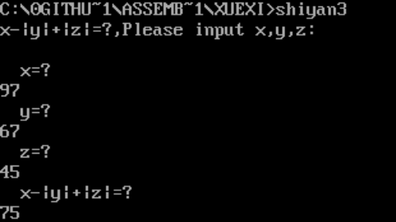
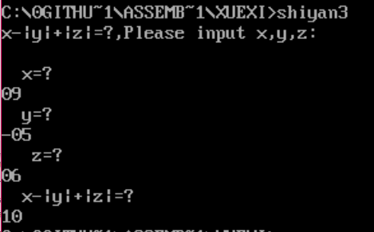

## 实验三 转移指令的使用

-----------------------------

### 1.实验目的
- （1）了解掌握汇编程序中指令跳转的实现；
- （2）掌握算法的设计及表达方式；
- （3）熟练应用 DEBUG 调试汇编程序。

-----------------------------

### 2.实验原理
- 1.）顺序执行的指令地址是由指令指针寄存器 IP 自动增量形成的，而程序
转移的地址必须由转移类指令和 CALL 指令指出，表示转向地址的寻址方式包括：
  - 段内直接寻址
  - 段内间接寻址
  - 段间直接寻址
  - 段间间接寻址
- 2.）与转移地址相关的有三个表示转移距离（称为位移量）的操作符：SHORT、
NEAR、FAR。
  - （1）SHORT，短转移，表示位移量在-128~127 字节之间。
  - （2）NEAR，近转移，表示在同一段内转移，位移量在-32768~32767 字节范围内。
  - （3）FAR，远转移，表示转移距离超过±32K 字节，在不同段之间转移。
- 3.）CS:IP 寄存器总是指向下一条将要执行的指令的首地址（称为 IP 当前值），
当转移指令执行后，必须修改 IP 或 CS、IP 的值。
  - （1）SHORT 转移和 NEAR 转移，位移量分别用 8 位和 16 位表示，程序控制仍然在当前代码段，所以只修改 IP 的值，CS 的值不变。
  - （2）FAR 转移，程序控制超出了当前代码段，所以 CS 和 IP 都必须修改为新的值。
- 4.）与转移地址有关的 4 种寻址方式就是告诉 CPU 如何修改 CS 和 IP 的值，以达到控制程序转移的目的。

------------------------------------

### 3.实验内容
题目：计算 X-|Y|+|Z|，并将计算结果输出显示。

--------------------------------------

### 4.实验要求
- （1）上机实验前，仔细复习课本有关知识；
- （2）独立完成实验，画出流程图并上交实验报告；
- （3）尝试手动输入未知数 X、Y、Z。

------------------------------------

### 4.实验步骤
- 1．）算法分析
从实验的内容分析可知，要完成如下实验，可分为以下步骤：
  - （1）接受键盘输入 X、Y、Z；
  - （2）计算|Y|、|Z|；
  - （3）计算结果并输出显示。
- 2．）算法设计
  - （1）输入未知数  
    - a. 使用 MOV AH,01H INT 21H 实行对字符串的输入，而事实上此功能一次只能输入一个字符，因此使用循环，将每次输入的值，保存在内存当中，当检测到回车字符（ODH）时，即结束当前的循环；
    - b. 负数的输入情况，判断是否有‘-’符号的输入，若有的话，则在最后的数取其补码，一个 AX16 位长，每 4 位表示一个数，因此目前最多只能表示 4 位数以内的加减法运算。
  - （2）计算绝对值
首先使用 TEST AX,8000H，来判断 AX 的最高位符号位是 1 还是 0，若是1 的话则需要 NEG AX,取 AX 的补码，进行运算，TEST 的实质是不保存结果的AND 运算；
  - （3）计算结果并输出
    - a. 最后的计算结果使用 MOV AH,09H INT 21H 进行输出，使用 AAM 等 BCD转换指令将 16 进制转换为 10 进制；
    - b. 判断最后结果的正负问题，若结果为负，则首先显示‘-’字符，再显示最后的结果的补码；
- 3．）完成实验报告

-------------------------
### 5.实验截图
手动输入两位数：



---------------------------

### 6.不足与改进
应当扩展到支持更多位，提高程序的容错性。

-------------------------

#### 源代码：
```asm
;x-|y|+|z|
;9-6+5=8
;最大支持两位数，97-|67|+|45|=75
;在输入负六时应输入-06
;目前暂不支持结果为负的情况
data segment
  x dw 9
  y dw -6
  z dw 5
  flag db 0
  msg db 'x-|y|+|z|=?,Please input x,y,z:',0ah,0dh,'$'
  xmsg db 0ah,'  x=?  ',0ah,0dh,'$'
  ymsg db 0ah,'y=?  ',0ah,0dh,'$'
  zmsg db 0ah,'z=?  ',0ah,0dh,'$'
  resultmsg db 0ah,'x-|y|+|z|=?',0ah,0dh,'$'
  result dw ?
data ends
stack segment
  dw 16 dup(0)
stack ends
assume cs:code,ds:data,ss:stack
code segment
absolute:
sub ax,0
jns ok
neg ax
ok:
ret
input :
push bx
mov flag,0
chongshu:

mov ah,01h
int 21h
cmp al,'-'
jnz continue
mov flag,1

mov ah,01h
int 21h
continue:

sub ax,0
aaa
mov bl,al
int 21h
aaa

mov ah,0
mov bh,0
mov cx,10
shi:add ax,bx
loop shi
;mov ax,bx
pop bx

cmp flag,0
jz zhen
neg ax
zhen:
mov word ptr[bx],ax

nop
ret
showstring:
mov ah,9
int 21h
mov ax,0
ret

start:

mov ax,data
mov ds,ax

mov dx,offset msg
call showstring
mov dx,offset xmsg
call showstring
lea bx,x
call input
mov ax,0200h
mov dx,word ptr[bx]
add dx,30h
;int 21h ;输出x

mov dx,offset ymsg
call showstring
lea bx,y
call input
mov ax,0200h
mov dx,word ptr[bx]
add dx,30h
;int 21h ;输出y

mov dx,offset zmsg
call showstring
lea bx,z
call input
mov ax,0200h
mov dx,word ptr[bx]
add dx,30h
;int 21h  ;输出z

mov dx,offset resultmsg
call showstring

mov ax,y
call absolute
mov bx,ax
mov ax,z
call absolute
mov bp,ax
mov ax,x
nop
sub ax,bx
add ax,bp
mov dx,ax
nop
mov bp,10
mov ax,dx
mov bx,1
imul bx
aam
add ax,3030h
mov bx,ax
mov dx,0
mov dl,bh
mov ah,2
int 21h
mov dl,bl
int 21h
mov ax,4c00h
int 21h
code ends
end start

```
