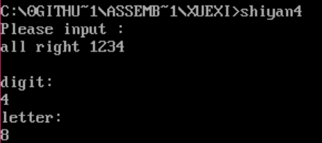

## 实验四 分支程序设计

-----------------------

### 1.实验目的
- (1)掌握汇编语言的分支程序设计的原理与方法;
- (2)掌握并能熟练应用汇编程序的输出显示设计方法;
- (3)掌握汇编程序的数据输入设计方法;
- (4)熟练应用 DEBUG 调试汇编程序;
- (5)掌握算法的设计及表达方式。

-------------------------

### 2.实验内容
- 题目:分类统计字符个数
- 内容:程序接受用户从键盘输入的一行字符(字符个数不超过 80 个字符,该字符串以回车符结束),并按字母、数字及其他字符分类统计个数,然后将相应的结果存放于 letter、digit 和 other 中,并在显示器上显示如下信息:
    - The counted result of the program:
    - letter:××
    - digit:××
    - other:××  
__注：××表示一个十进制数__

----------------------------    

### 3.实验要求
- (1)上机实验前,仔细复习课本有关知识;
- (2)独立完成实验,画出流程图并上交实验报告;
- (3)尝试将结果输出,如不输出,可通过单步执行,将内存单元 letter、digit 和 other 中的内容显示并截图。

-------------------------------

### 4.实验步骤
- 1.)算法分析
从实验的内容分析可知,要完成如下实验,可分为以下步骤:
  - (1)接受键盘的输入,以回车键结束输入;
  - (2)对输入的字符分类统计;
  - (3)输出统计结果。
- 2.)算法设计
  - (1)输入与统计  
  已知:ASCII 码的 0DH 为回车符,DOS 的 1 号功能可接受键盘的输入,存放在(AL)中,可以选用如下算法(伪代码):
```cpp
01h->AH;
NEXTCHAR:
INT 21H;
22if (AL)!= 0DH
if (AL)== letter
letter++;
else if(AL)== digit
digit ++;
else other++;
else JMP NEXTOPERATION
JMP NEXTCHAR;
```
  - (2)输出显示  
  请思考如何将内存中存放的十六进制数转换成 ASCII 码表示的十进
制数并输出。(提示:参考将十进制数转换成二进制数的方法,必要时可借
助堆栈)


-  3.)完成实验报告

-------------------------------

### 5.实验截图



-------------------------------

### 6.源代码

```asm
data segment
letter db 0
digit  db 0
other  db 0
 msg db 'Please input :',0ah,0dh,'$'
 imsg db 'iloveyou',0ah,0dh,'$'
 ;数字 		30h-39h 0011,0000~0011,1001B
 ;大写字母  41h-5ah 0100,0001~0101,1010B
 ;小写字母  61h-7ah 0110,0001~0111,1010B
 ;也可以用test指令简化程序
 buf1 db 100 dup(0)
 dmsg db 0ah,'digit:',0ah,0dh,'$'
 lmsg db 0ah,'letter:',0ah,0dh,'$'
data ends
assume cs:code,ds:data
code segment
showtotal:mov ah,02h
add dx,30h
int 21h
ret
showstring:mov ah,09h
int 21h
ret
start:  mov ax,data
        mov ds,ax
        mov dx,offset msg
        mov ah,09h
        int 21h
     nextchar:      mov ah,01h
 		   int 21h
        cmp al,'A'
        jb xiao
        cmp al,'Z'
        ja  da
        inc letter
    xiao:cmp al,'0'
         jb exit
         cmp al,'9'
         ja exit
         inc digit
    da  :cmp al,'a'
         jb exit
         cmp al,'z'
         ja exit
         inc letter
  exit:
        sub ax,0
  		cmp al,0dh
       jnz nextchar
final:
      mov dx,offset dmsg
      call showstring
      mov dl,digit
      call showtotal
      mov dx,offset lmsg
      call showstring
      mov dl,letter
      call showtotal
  		mov ax,4c00h
        int 21h
code ends
end start
```
