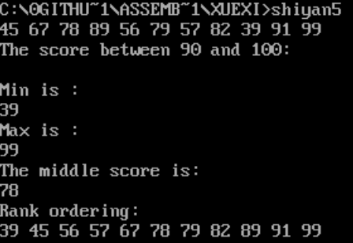

## 实验五 循环程序设计

--------------------------

### 1.实验目的
- (1)掌握汇编语言的循环程序设计的原理与方法;
- (2)掌握并能熟练应用汇编程序的输出显示设计方法;
- (3)掌握汇编程序的循环算法编写;
- (4)熟练应用 DEBUG 调试汇编程序;
- (5)掌握算法的设计及表达方式。

-----------------------------------

### 2.实验内容
- __题目__:  
  - 对随机输入的 11 名学生的成绩进行排序与分数段人数统计,输出最高分,最低分,中间值以及排序后的成绩。
- __内容__:  
  - 定义存储空间存放成绩,输出不及格人数,60~69 分数段人数,......,90~100 分数段人数,对成绩进行排序,输出排序后的结果,在显示器上显示如下信息:
```
The score between 90 and 100 : ××
......
The score between 0 and 59 :××
Min is ××
Max is ××
The middle score is ××
Rank ordering : ×× ×× ××......
````
××表示一个十进制数  

-----------------------------------

### 3.实验要求
- (1)上机实验前,仔细复习课本有关知识;
- (2)独立完成实验,画出流程图并上交实验报告;

--------------------------------------

### 4.实验步骤
-  1.)算法分析
从实验的内容分析可知,要完成如下实验,可分为以下步骤:
  - (1)输入分数并转换;
  - (2)排序,得到中间值,最高分,最低分;
  - (3)统计各个分数段的人数;
  - (4)输出结果。
-  2.)算法设计
  - (1)输入与转换  
  定义一个缓冲区,存放操作者以数字和空格键入的字符串:
```asm
BUF db 8 0,?,80 dup(0)
```
    提示:输入分数以空格(20H)隔开,通过判断是否为空格划分分数。对于不是空格的字符需要看它的后一个字符是不是空格,如果是则它是个位数,如果不是则该数字将是一个两位数,然后进行相应的操作;在数据段定义 11 个存储空间以存放进行操作后的 11 个键入的分数。

    - (2)排序  
      - 可运用冒泡排序,选择排序等方法对 11 个分数进行排序。
    - (3)统计人数与输出显示
      - 可参考实验四。
-  3.)完成实验报告

----------------------------------------------

### 5.实验截图



-------------------------------------------------

### 6.源代码

```asm
data segment
	buf   db  80,?,80 dup('$')
	score db  80 dup('$')
	x     dw  0
 msg 	db 'The score between 90 and 100:',0ah,0dh,'$'
 minmsg db 'Min is :',0ah,0dh,'$'
 maxmsg db 'Max is :',0ah,0dh,'$'
 midmsg db 'The middle score is:',0ah,0dh,'$'
 rankmsg 	db 'Rank ordering:',0ah,0dh,'$'
data ends
stack segment
   db 16 dup(0)
stack ends
assume cs:code,ds:data,ss:stack
code segment
huanhang:
	mov ah,02h
	mov dl,0ah
	int 21h
	ret
showstring:
	mov ah,09h
	int 21h
	ret
transf:
   push cx
	mov x,0
	mov cx,2
	getnum:
		mov al,[si]
		sub ax,0
		cmp al,20h
		jnz feikongge
		inc si
		jmp getnum
feikongge:
		and ax,000fh
		xchg ax,x
		mov dx,10
		mul dx
		add x,ax
		inc si
	loop getnum
	mov ax,x
	mov word ptr score[di],ax
	mov x,0
	add di,2
   pop cx
 ret
xianshi:
	mov cx,20
	mov di,0
	show:
		mov ah,2
		mov bx,word ptr score[di]
		mov dl,bl
		add dl,30h
		int 21h
		add di,2
		loop show
		call huanhang
	ret
huanchong:
		mov ah,9
		lea dx,buf+2
		int 21h
		ret
bin2dec:
		mov ax,bp
		mov bl,1
		imul bl
		aam
		add ax,3030h
		mov bx,ax
		mov ah,2
		mov dl,bh
		int 21h
		mov dl,bl
		int 21h
		ret
zhanshi:
mov cx,11
mov si,0
xx:mov bp,word ptr score[si]
call bin2dec
mov ah,2
mov dl,20h
int 21h
add si,2
loop xx
ret  
start:
;mov ax,stack
;mov ss,ax
;mov sp,20h
mov ax,data
mov ds,ax
mov  dx, offset buf
mov ah,10
int 21h
mov ah,2
mov dl,0dh
int 21h

call huanhang

lea si,buf
add si,2
mov cx,11
mov di,0
shu:call transf
loop shu
exit:

mov bx,0
mov cx,10;循环次数：11-1=10（次）
daxunhuan:mov dx,cx
          mov di,0
     	  xiaos:
      			 mov bp,word ptr score[di]
     			 add di,2
   			     cmp bp,word ptr score[di]
       			 jna zhenchang
     		    xchg bp,word ptr score[di]
     			zhenchang:
    			 mov word ptr score[di-2],bp
   			  loop xiaos
    	 mov cx,dx
    	 loop daxunhuan
    	 nop
    	 nop  

	mov di,0
	mov dx,offset msg
	call showstring
	;call xianshi


	call huanhang
	mov ah,2
	mov dl,0dh
	int 21h
	mov ah,9
	mov dx,offset minmsg
	int 21h

mov bx,word ptr score[0]
mov bp,bx
call bin2dec
call huanhang


mov dx,offset maxmsg
call showstring
mov bx,word ptr score[10*2]
mov bp,bx
call bin2dec
call huanhang

mov dx,offset midmsg
call showstring
mov bx,word ptr score[5*2]
mov bp,bx
call bin2dec
call huanhang

mov dx,offset rankmsg
call showstring
call zhanshi
mov ax,4c00h
int 21h

code ends
end start
```
