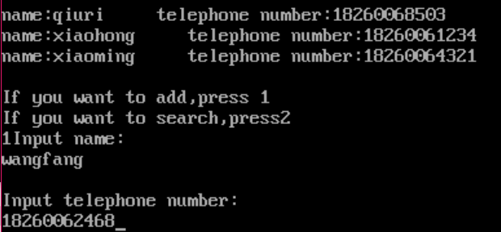
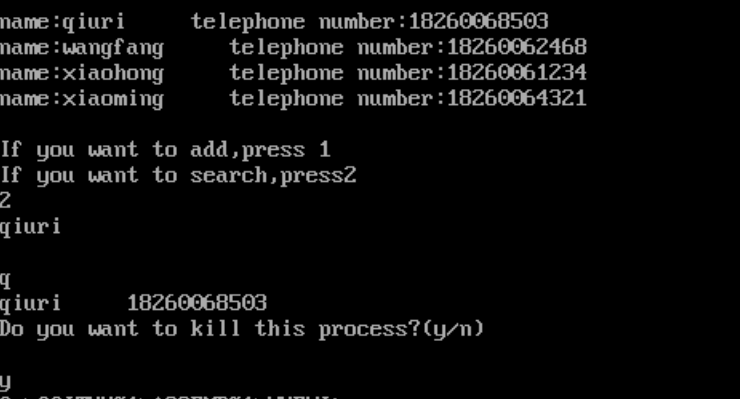

## 实验六 子程序设计

-------------------------

### 1.实验目的
- (1) 综 合 掌 握 比 较 复 杂 的 汇 编 程 序 设 计 方 法 ;
- (2)熟练应用 DEBUG 调试汇编程序;
- (3)掌握算法的设计及表达方式。

------------------------------

### 2.实验原理
利用本学期所学知识:汇编语言数据的存储方式,循环程序、分支程序
以及子程序设计的方法,DOS 中断调用等,设计一个比较复杂的综合应用程序。

-------------------------------

### 3.实验内容
- 1.)建立一个可存放 50 项的电话号码表,每项包括人名(20 个字符)及电话号码(8 个字符)两部分;
- 2.)程序可接收输入人名及相应的电话号码,并把它们加入电话号码表中;
- 3.)凡有新的输入后,程序应按人名对电话号码表重新排序;
- 4.)程序可接收需要查找电话号码的人名,并从电话号码表中查出电话号码,再在屏幕上显示出来 。
```
name tel..
××× ×××
```
---------------------------

### 4.实验要求
- 1.)上机实验前,仔细复习课本有关知识;
- 2.)独立完成实验,画出流程图并上交实验报告;
- 3.)主程序的主要部分如下:
    - (1) 显示提示符‘Input name:’;
    - (2) 调用子程序 input_name 接收人名;
    - (3) 调用子程序 stor_name 把人名存入电话号码表 tel_tab 中;
    - (4) 显示提示符‘Input a telephone number:’;
    - (5) 调用子程序 inphone 接收电话号码,并把它存入电话号码表按人名排序;
    - (6) 显示提示符‘Do you want a telephone number?(Y/N)’;
    - (7) 回答 N 则退出程序;
    - (8) 回答 Y 则再显示提示符‘name?’;
    - (9) 调用子程序 input_name 接收人名;
    - (10) 调用子程序 name_search 在电话号码表中查找所要的电话号码;
    - (11) 调用子程序 printline 按要求格式显示人名及电话号码;
    - (12) 重复查号提示符直至用户不再要求查号为止。
-   4.)完成实验报告。

---------------------------------------

### 5.实验截图

- 输入人名和电话号码  

- 选择是继续增加记录还是搜索电话簿  

- 搜索结果  


-------------------------------------------

### 6.源代码

```asm
data segment
  msgname          db 'Input name:$'
  msgphone         db 'Input telephone number:$'
  msgtishi         db 'If you want to add,press 1',0DH,0AH,'If you want to search,press2',0DH,0AH,'$'
  msgyn            db 'Do you want to kill this process?(y/n)',0dh,0ah,'$'
  huanchong        db 16,?, 17 dup(?)
  shows            db 30 dup('0')
  hmtimes          db 0
  cxvalue       dw 3
  temp             db 20 dup('1')
  msg1             db 'name:$'
  msg2             db 'telephone number:$'
  msgkongge        db  5 dup(32),'$'
  pos           dw 0
  total         dw 3
  zhaodaoweizhi dw 0
  ;开始一次性输入3个人，如果有新增的，total会加
data ends
assume ds:data,cs:code,es:extra,ss:stack
stack segment
    db 200 dup (0)
stack ends
extra segment
    namespace db 800 dup('0')
    numspace  db 800 dup('0')
extra ends
code segment

;初始化宏，设置数据段，附加端，栈段
init macro
    mov ax,data
    mov ds,ax
    mov ax,extra
    mov es,ax
    mov ax,stack
    mov ss,ax
    mov sp,200
endm

;结束宏，4c号中断
finish macro
    mov ax,4c00h
    int 21h
endm

;输入字符串宏
inputstr macro str
    mov ah,10       ;10号中断输入字符串
    lea dx,str
    int 21h
    mov al,str+1  ;str[0]为最大允许字符数，str[1]为实际输入数
    add al,2
;str[2]开始是正文，正文结束的后一个字符为str[实际输入个数+2]
    mov ah,0
    mov si,ax
    mov bp,ax
    mov str[si],'$';在字符串结尾添加$符号
endm

;显示字符串(对应inputstr宏)
showstr macro str
    mov ah,9
    lea dx,str+2
    int 21h
endm

;显示字符串提示
showmsg macro msg
    mov ah,9
    lea dx,msg
    int 21h
endm

;2号功能显示0-9字符
showchar macro char
    mov ah,2
    mov dl,char
    add dl,30h    ;0-9数值加30h为其对应ASCII码
    int 21h
endm

;字符串存储宏
store macro dest,cishu
    lea si,huanchong+2
;缓冲区是通过10号功能输入的，从huanchong[2]开始
    lea di,dest
    mov ah,0
    mov al,cishu
    mov cx,16
;缓冲区大小为16
    mul cx
    add di,ax ;通过这种方式实现对二维数组的寻址
    cld
    mov cx,bp
    rep movs byte ptr es:[di],ds:[si]
endm

showch macro ch  ;2号功能显示字符
    mov ah,2
    mov dl,ch
    int 21h
endm

maopao macro space
local outlp
local inlp
local next
local xunhuan
local huan
local jishu
local budeng
local compare
local jieliinlp
local jielioutlp
;定义本地local标号
;不然当不止调用一次时，多个相同的标号被嵌进主程序，引发混乱
  ;mov cx,3
      mov cx,total;total这个字单元存着待排序的总人数
      dec cx;外循环的次数为(总人数-1)
      mov si,0;si中存第几个人
      mov bx,0;bx存对某人的姓名中某个字符的相对偏移地址
      mov dx,cx
outlp:mov dx,cx;外层循环，保存cx到dx
      mov bx,0
      mov si,0
inlp: mov al,byte ptr es:space[si][bx]
      cmp al,byte ptr es:space[si][bx+16]
       ;比较相邻两个人的对应位置的字母
      jb next  ;如果是顺序则下一个
      ja huan  ;如果是逆序则交换
;以下代码一直到huan标号前都是对两个字母相同情况处理
      push cx  ;保存cx,bx
      push bx
jishu:inc bx   ;计数，计算从此字符到$符号还有几个，作为cx值
      mov al,byte ptr es:space[si][bx]
      cmp al,'$'
      jnz jishu
      mov cx,bx ;离字符串介绍还剩几个字符就循环几次
      mov bx,0
compare:    mov al,byte ptr es:space[si][bx]
            cmp al,byte ptr es:space[si][bx+16]
            jnz budeng;比较下一个字符，直到出现不同字符为止
            inc bx
            loop compare
;;;;;;;;;;;;;;;;;;;;;;;;;;;;;;;;;;;;;;;;;完全匹配      
      mov bx,0
      pop bx   ;恢复bx，cx
      pop cx
      jmp next ;如果这两个字符串完全相同就下一个
;;;;;;;;;;;;;;;;;;;;;;;;;;;;;;;;;;;;;;接力站
jieliinlp:jmp inlp
jielioutlp:jmp outlp
;;;;;;;;;;;;;;;;;;;;;;;;;;;;;;;;;;;;;;接力站
   budeng : pop bx ;恢复bx，cx,对应前面的pop
            pop cx
            jb next ;如果是顺序则下一个
            ja huan ;如果是逆序则交换
   huan: exchange namespace ;把相邻人的名字交换
         exchange numspace  ;把相邻人的电话号码交换
      ;;;;;;xchg al,byte ptr es:space[si][bx+16]
      ;;;;;;mov byte ptr es:space[si][bx],al
  next:  add si,16
         dec dx  ;把dx中保存的cx值减1
         cmp dx,0
        jnz jieliinlp ;内层循环
        loop jielioutlp ;外层循环
endm

;交换宏;通过栈暂存数据，交换相邻的人的名字或电话号码
exchange macro space
local xunhuan
     push cx
     push bx
                mov cx,8
       xunhuan: push word ptr es:space[si][bx+16]
                push word ptr es:space[si][bx]
                pop word ptr es:space[si][bx+16]
                pop word ptr es:space[si][bx]
                add bx,2
       loop xunhuan
      pop bx
      pop cx
endm

;显示宏
show macro dest
local ok    ;宏汇编中防止多次存入同一个地址, 用local
local jieshu;宏汇编中防止多次存入同一个地址，用local
   mov ah,2 ;2号功能只能显示一个字符
   lea di,dest ;通过判断是否到了$符号来达到显示字符串的目的
ok:mov dl,es:[di]
   cmp dl,'$'
   jz jieshu
   int 21h
   inc di
   jmp ok
jieshu: nop
endm

enter macro ;回车宏
    mov ah,2
    mov dl,0ah
    int 21h
endm

display macro ;此宏主要供调试时显示内存的内容
local aga
local agai
    mov di,0
    mov cx,100
    mov ah,2
    mov bx,0
aga:mov dl,byte ptr es:namespace[di][bx]
    inc di
    int 21h
    loop aga
    mov cx,100
    mov di,0
agai:mov dl,byte ptr es:numspace[di][bx]
    inc di
    int 21h
    loop agai
endm

;展示存储后的姓名宏
;用在输入姓名之后
restoreshowname macro  
local again
    push di
    push cx
    mov cx,8
    mov di,0
again:
    push word ptr es:namespace[di][bx]
    pop word ptr ds:temp[di]
;把附加段的姓名区的内容缓存到数据段的temp区
    add di,2
    loop again
    mov ah,9
    mov dl,offset temp
;把temp区字符串的内容用9号功能显示输出
    int 21h
    pop cx
    pop di
endm

;展示存储后的电话号码宏
;用在存好电话号码之后
restoreshownum macro
local again
push di
push cx
    mov cx,8
    mov di,0
  again:
    push word ptr es:numspace[di][bx]
    pop word ptr ds:temp[di]
    add di,2
  loop again
    mov ah,9
    mov dl,offset temp
    int 21h
pop cx
pop di
endm

;此宏主要用在调试阶段
;调试完成后此宏没什么用
displ macro
local aga
local agai
    mov di,0
    mov cx,3
    mov ah,2
    mov bx,0
aga:mov dl,byte ptr es:namespace[di][bx]
    add di,16
    int 21h
    loop aga
    mov cx,3
    mov di,0
agai:mov dl,byte ptr es:numspace[di][bx]
    add di,16
    int 21h
    loop agai
endm


showlist macro
local again
      enter
      enter
      mov bx,0
      mov cx,total          ;有多少人就显示多少次
      ;mov cx,3
    again:
      showmsg msg1          ;输入姓名提示
      restoreshowname  pos  ;把姓名存到对应位置
      showmsg msgkongge     ;显示空格
      showmsg msg2          ;输入号码提示
      restoreshownum        ;把号码存到对应位置
      enter
      add bx,16
      mov pos,bx            ;弄好下一个位置
    loop again
endm

search macro   ;搜索宏
local aga
local again
local ok
local s
local xunhuan
local success
local zhaodao
    inputstr huanchong
    showstr huanchong
enter
enter
    xor dx,dx
    mov dl,huanchong[1]
    mov bp,dx
    mov di,0

    ;mov cx,3;;;;;;;;;;;;;;;;;;;;;;;;;;;;;;;;;;;;;;;;;;;;;;;;;
    mov cx,total
again:mov dl,byte ptr es:namespace[di]
    mov ah,2
    int 21h
    cmp dl,byte ptr huanchong[2]
    jz ok
    add di,16
loop again

ok:mov zhaodaoweizhi,di
    push di;;;;;;;这句话比较麻烦
;;;;;;;;;;;;;;;;;;;;;;;;;;;;;;;;;;;;;;;;;;;;;;;;;;;;第一个字母相同后匹配后面的字母
push bx
;;;;;;;;;;;;;;;;push di
push cx
mov bx,0
mov cx,bp
lea si,namespace
add di,si
lea si,huanchong
add si,2
repz cmpsb
;;mov dl,byte ptr es:namespace[di][bx]
;;cmp dl,byte ptr huanchong[bx+2]
cmp cx,0
jz zhaodao
pop cx
;;;;;;;;;;;;;;;;pop di
pop bx
pop di
add di,16
dec cx
jmp again
;;;;;;;;;;;;;;;;;;;;;;;;;;;;;;;;;;;;;;;;;;;;;;;;;;;;;匹配成功，跳出
zhaodao:
        pop cx
        pop bx
        pop di

;;;;;;;;;;;;;;;;;;;;;;;;;;;;;;;;;;;;;;;;;;;;;;;;;;;;;
    enter
    mov cx,8
    mov bx,0
s:
    push word ptr es:namespace[di][bx]
    pop word ptr ds:temp[bx]
    add bx,2
loop s
    showmsg temp
    showmsg msgkongge
  ;;;;;;;;;;;pop di
mov di,zhaodaoweizhi
    mov cx,8
    mov bx,0
xunhuan:
    push word ptr es:numspace[di][bx]
    pop word ptr ds:temp[bx]
    add bx,2
loop xunhuan
showmsg temp
endm

main proc far
start:
      init
      mov hmtimes,0;hmtimes存第几次，从第0个开始
next: mov cx,cxvalue
;cxvalue即一次输入人数，开始设定为3个
;到后来若继续输入,会改变cxvalue的值继续执行这段代码
      showmsg msgname;提示输入姓名，回车
      enter
      inputstr huanchong;输入姓名至缓冲区
      showstr huanchong
      enter
      store namespace,hmtimes
;;;;show namespace
      enter
      jmp phone
jieli:
      jmp next
phone:
      showmsg msgphone
      enter
      inputstr huanchong
      showstr huanchong
      enter
      store numspace,hmtimes
;;;;show numspace
      enter
      inc hmtimes
      mov cx,cxvalue
      dec cxvalue
      loop jieli
      enter
    display
      maopao namespace
    display
      showlist
fenzhi:  enter
      showmsg msgtishi
      mov ah,1
      int 21h
      cmp al,'1'
      jz tianjia
      cmp al,'2'
      jz jielitwo
tianjia:
      mov cxvalue,1
      inc total
      jmp jieli
      jielitwo:jmp sousuo
      showlist
sousuo:
      enter
      search
      enter
      showmsg msgyn
      enter
      mov ah,1
      int 21h
      cmp al,'y'
      jz jieshule
      jmp fenzhi
jieshule:      finish
main endp
code ends
end start
```
